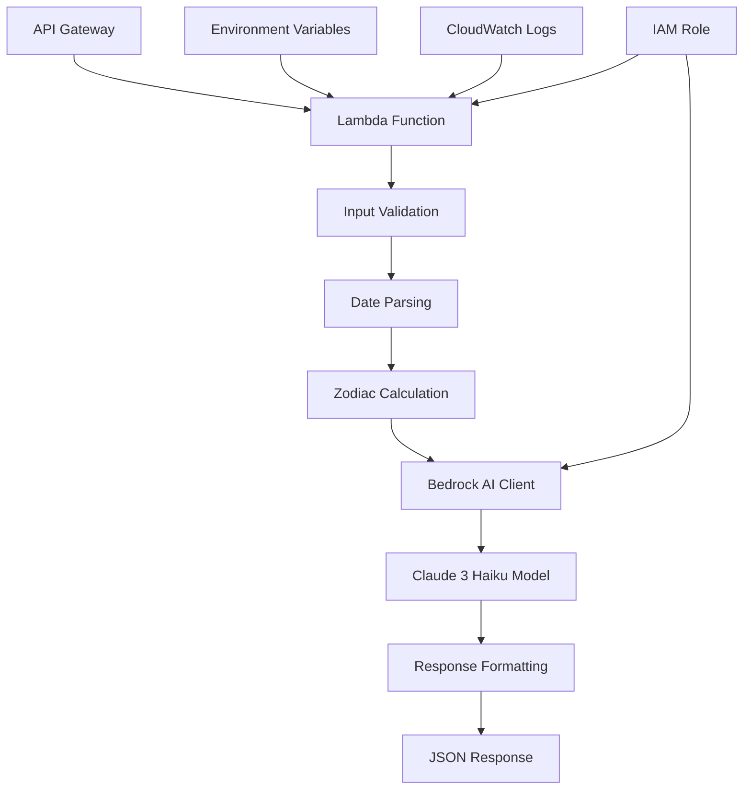

# Design Document

## Overview

The CloudHoroscopeFunction is a serverless AWS Lambda function that combines astrological calculations with AI-powered content generation to create entertaining, cloud-themed horoscopes. The system processes user input (name and date of birth), determines zodiac signs using astronomical date ranges, and leverages Amazon Bedrock's Claude 3 Haiku model to generate personalized, AWS-themed horoscope content.

The architecture follows serverless best practices with proper error handling, environment-based configuration, and API Gateway compatibility for seamless integration with web applications.

## Architecture



The function operates as a stateless, event-driven service that processes each request independently. Input flows through validation, zodiac calculation, AI generation, and response formatting stages.

## Components and Interfaces

### Core Components

#### 1. Lambda Handler (`lambda_handler`)
- **Purpose**: Main entry point for AWS Lambda execution
- **Input**: `event` (API Gateway event), `context` (Lambda context)
- **Output**: API Gateway-compatible JSON response
- **Responsibilities**:
  - Extract and validate input parameters
  - Orchestrate the horoscope generation workflow
  - Handle exceptions and format error responses
  - Return structured JSON responses

#### 2. Zodiac Calculator (`get_zodiac_sign`)
- **Purpose**: Determine zodiac sign from birth date
- **Input**: `day` (int), `month` (int)
- **Output**: Zodiac sign string (e.g., "Libra")
- **Logic**: Uses astronomical date ranges for each zodiac sign:
  - Aries: March 21 - April 19
  - Taurus: April 20 - May 20
  - Gemini: May 21 - June 20
  - Cancer: June 21 - July 22
  - Leo: July 23 - August 22
  - Virgo: August 23 - September 22
  - Libra: September 23 - October 22
  - Scorpio: October 23 - November 21
  - Sagittarius: November 22 - December 21
  - Capricorn: December 22 - January 19
  - Aquarius: January 20 - February 18
  - Pisces: February 19 - March 20

#### 3. Bedrock Client (`generate_horoscope`)
- **Purpose**: Interface with Amazon Bedrock for AI content generation
- **Input**: `name` (string), `zodiac_sign` (string)
- **Output**: Generated horoscope text
- **Configuration**:
  - Model ID: "anthropic.claude-3-haiku-20240307"
  - Region: Configurable via environment or default to us-east-1
  - Max tokens: 150-200 for concise responses
  - Temperature: 0.7 for creative but consistent output

#### 4. Input Validator (`validate_input`)
- **Purpose**: Validate and sanitize user input
- **Input**: Raw event body
- **Output**: Validated name and date of birth
- **Validation Rules**:
  - Name: Non-empty string, max 100 characters
  - DOB: Exact dd/mm/yyyy format, valid date range (1900-current year)

### Interface Specifications

#### Input Schema
```json
{
  "name": "string (required, 1-100 chars)",
  "dob": "string (required, dd/mm/yyyy format)"
}
```

#### Success Response Schema
```json
{
  "statusCode": 200,
  "body": {
    "project": "string (from PROJECT_NAME env var)",
    "author": "string (from AUTHOR_NAME env var)",
    "sign": "string (zodiac sign)",
    "horoscope": "string (AI-generated content)"
  }
}
```

#### Error Response Schema
```json
{
  "statusCode": 400,
  "body": {
    "error": "string (descriptive error message)"
  }
}
```

## Data Models

### Environment Configuration
```python
@dataclass
class Config:
    project_name: str = "Cloud Horoscope"
    author_name: str = "Unknown Author"
    default_message: str = "Welcome to Cloud Horoscope powered by AWS!"
    bedrock_model_id: str = "anthropic.claude-3-haiku-20240307"
    bedrock_region: str = "us-east-1"
```

### Zodiac Sign Mapping
```python
ZODIAC_RANGES = [
    ((3, 21), (4, 19), "Aries"),
    ((4, 20), (5, 20), "Taurus"),
    ((5, 21), (6, 20), "Gemini"),
    ((6, 21), (7, 22), "Cancer"),
    ((7, 23), (8, 22), "Leo"),
    ((8, 23), (9, 22), "Virgo"),
    ((9, 23), (10, 22), "Libra"),
    ((10, 23), (11, 21), "Scorpio"),
    ((11, 22), (12, 21), "Sagittarius"),
    ((12, 22), (1, 19), "Capricorn"),
    ((1, 20), (2, 18), "Aquarius"),
    ((2, 19), (3, 20), "Pisces")
]
```

### Bedrock Request Structure
```python
bedrock_request = {
    "modelId": "anthropic.claude-3-haiku-20240307",
    "contentType": "application/json",
    "accept": "application/json",
    "body": json.dumps({
        "anthropic_version": "bedrock-2023-05-31",
        "max_tokens": 200,
        "temperature": 0.7,
        "messages": [
            {
                "role": "user",
                "content": prompt_template.format(name=name, sign=sign)
            }
        ]
    })
}
```

## Error Handling

### Error Categories and Responses

#### 1. Input Validation Errors
- **Missing required fields**: 400 - "Missing required field: {field_name}"
- **Invalid date format**: 400 - "Invalid date format. Please use dd/mm/yyyy."
- **Invalid date values**: 400 - "Invalid date. Please provide a valid date."
- **Name validation**: 400 - "Name must be between 1 and 100 characters."

#### 2. Bedrock Service Errors
- **Service unavailable**: 503 - "AI service temporarily unavailable. Please try again."
- **Rate limiting**: 429 - "Too many requests. Please try again later."
- **Model errors**: 500 - "Error generating horoscope. Please try again."

#### 3. System Errors
- **Unexpected exceptions**: 500 - "Internal server error. Please try again."
- **Timeout errors**: 504 - "Request timeout. Please try again."

### Error Handling Strategy
```python
def handle_error(error_type: str, message: str, status_code: int = 500):
    return {
        "statusCode": status_code,
        "headers": {
            "Content-Type": "application/json",
            "Access-Control-Allow-Origin": "*"
        },
        "body": json.dumps({
            "error": message,
            "timestamp": datetime.utcnow().isoformat(),
            "request_id": context.aws_request_id if context else None
        })
    }
```

## Testing Strategy

### Unit Testing Approach

#### 1. Zodiac Calculation Tests
- Test all 12 zodiac signs with boundary dates
- Test edge cases (leap years, year boundaries)
- Test invalid date inputs

#### 2. Input Validation Tests
- Test valid input formats
- Test missing fields
- Test invalid date formats
- Test edge cases for name validation

#### 3. Bedrock Integration Tests
- Mock Bedrock responses for consistent testing
- Test error handling for service failures
- Test prompt generation and formatting

#### 4. Lambda Handler Tests
- Test complete request/response cycle
- Test error scenarios
- Test environment variable handling

### Integration Testing

#### 1. End-to-End Flow Tests
- Test complete user journey from input to response
- Test with actual Bedrock service (in staging)
- Test API Gateway integration

#### 2. Performance Tests
- Test cold start performance
- Test concurrent request handling
- Test memory and timeout limits

### Test Data Sets
```python
TEST_CASES = [
    {"name": "John", "dob": "15/03/1990", "expected_sign": "Pisces"},
    {"name": "Jane", "dob": "21/03/1990", "expected_sign": "Aries"},
    {"name": "Bob", "dob": "29/02/2000", "expected_sign": "Pisces"},  # Leap year
    {"name": "Alice", "dob": "31/12/1999", "expected_sign": "Capricorn"}
]
```

## Security Considerations

### IAM Role Configuration
```json
{
  "Version": "2012-10-17",
  "Statement": [
    {
      "Effect": "Allow",
      "Action": [
        "bedrock:InvokeModel",
        "bedrock:InvokeModelWithResponseStream"
      ],
      "Resource": "arn:aws:bedrock:*:*:model/anthropic.claude-3-haiku-20240307"
    },
    {
      "Effect": "Allow",
      "Action": [
        "logs:CreateLogGroup",
        "logs:CreateLogStream",
        "logs:PutLogEvents"
      ],
      "Resource": "arn:aws:logs:*:*:*"
    }
  ]
}
```

### Input Sanitization
- Validate all user inputs before processing
- Limit input sizes to prevent abuse
- Sanitize strings to prevent injection attacks
- Use parameterized queries for any data storage

### Environment Variables Security
- Store sensitive configuration in environment variables
- Use AWS Systems Manager Parameter Store for secrets
- Implement proper access controls for configuration

## Performance Optimization

### Lambda Configuration
- **Memory**: 256 MB (sufficient for text processing and API calls)
- **Timeout**: 30 seconds (allows for Bedrock API latency)
- **Runtime**: Python 3.11 (latest stable version)

### Bedrock Optimization
- Use connection pooling for boto3 clients
- Implement retry logic with exponential backoff
- Cache zodiac calculations (though minimal benefit)
- Optimize prompt length for faster generation

### Cold Start Mitigation
- Keep imports minimal and efficient
- Initialize boto3 clients outside handler when possible
- Use provisioned concurrency for high-traffic scenarios