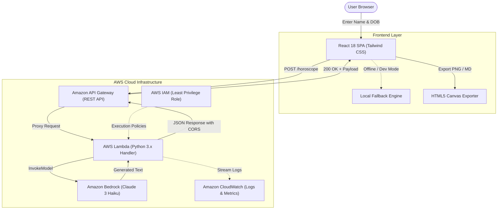

# ☁️ Cloud Horoscope

> **Where your zodiac meets the cloud.**

Cloud Horoscope is a serverless, AI-powered web application that bridges Western astrology with modern cloud engineering. By analyzing a user's name and date of birth, the application calculates their accurate zodiac sign and orchestrates Amazon Bedrock foundation models through AWS Lambda to generate witty, personalized, cloud-themed horoscopes.

[](https://react.dev/)
[](https://www.python.org/)
[](https://aws.amazon.com/lambda/)
[](https://aws.amazon.com/bedrock/)
[](https://aws.amazon.com/api-gateway/)
[](https://tailwindcss.com/)

> 🏆 **Featured in the Builder Zone at AWS Community Day Vadodara 2025**

---

## ✨ Project Preview

```
+-------------------------------------------------------------------------+
|                      [ PROJECT SCREENSHOTS ]                            |
+-------------------------------------------------------------------------+
|                                                                         |
|  1. Landing Page & Input                                                |
|     <!-- Add screenshot: docs/images/landing-page.png -->               |
|     * Name input, DOB picker, quick-demo presets & live Zodiac preview *|
|                                                                         |
|  2. Cosmic Cloud Reading Card                                           |
|     <!-- Add screenshot: docs/images/reading-card.png -->               |
|     * AI reading, Lucky Service, Lucky Region & SLA Resilience Score *  |
|                                                                         |
|  3. Horoscope Variations & Refresh                                      |
|     <!-- Add screenshot: docs/images/variations-flow.png -->            |
|     * Dynamic cycling through multiple generated cloud readings *       |
|                                                                         |
|  4. Export & Social Sharing                                             |
|     <!-- Add screenshot: docs/images/export-modal.png -->               |
|     * Canvas-generated PNG image cards and formatted Markdown export *  |
|                                                                         |
+-------------------------------------------------------------------------+
```

---

## 🌌 Why Cloud Horoscope?

Traditional horoscopes predict what celestial alignments mean for your personal life. **Cloud Horoscope** asks a slightly different question: *what does your infrastructure have planned for you today?*

* **Developer-Centric Astrology:** Connects personality traits to real-world cloud engineering experiences—from unpredictable traffic spikes to immaculate IAM configurations.
* **Practical AI Implementation:** Demonstrates a production-ready pattern for combining serverless AWS compute with generative AI foundation models.
* **Dual-Engine Resilience:** Designed with full offline parity so users can explore readings locally even when disconnected from live cloud endpoints.
* **Shareable Deliverables:** Generates downloadable graphics and structured Markdown summaries for team retrospectives and standups.

---

## ⚡ Key Features

| Feature | Description | Implementation |
|---|---|---|
| ♈ **Zodiac Detection** | Astronomical date-range matching across all 12 signs | Client-side & Lambda mathematical engines |
| 🤖 **AI-Powered Readings** | Contextual, humorous cloud predictions | Amazon Bedrock (`claude-3-haiku`) |
| ☁️ **Lucky AWS Service** | Tailored service pairing based on elemental energy | Architectural mapping (e.g., Fire → Lambda/Spot) |
| 🌎 **Lucky AWS Region** | Assigned low-latency cosmic region | Global AWS region matrix |
| 📊 **Resilience Score (SLA)** | Uptime & fault-tolerance rating for the day | Custom reliability scoring algorithm |
| 🔄 **Multi-Variation Cycling** | Generates fresh cosmic perspectives on demand | Request offset & prompt variation index |
| 📋 **Clipboard Sharing** | One-click copy for Slack, Discord, and teams | Async Clipboard API with fallback support |
| 📄 **Markdown Export** | Formatted report export for documentation | Blob generator with automated download |
| 🖼️ **PNG Image Cards** | High-resolution 2x Retina cards for social sharing | Direct HTML5 Canvas drawing & rendering |
| 🔌 **API / Local Engine Toggle** | Runtime switching between live AWS Gateway and offline mode | Modal configuration stored in `localStorage` |

---

## 🏛️ AWS Architecture

The application implements a decoupled, event-driven serverless architecture connecting a single-page frontend to generative AI on AWS:



### AWS Services Breakdown

| AWS Service | Role in Cloud Horoscope | Configuration & Usage |
|---|---|---|
| **Amazon Bedrock** | Generative AI foundation model provider | Invokes `anthropic.claude-3-haiku-20240307` with tuned temperature and custom engineering prompts. |
| **AWS Lambda** | Serverless backend compute | Validates user payload, calculates astronomical date bounds, coordinates Bedrock invocation, and formats output. |
| **Amazon API Gateway** | Managed REST API entrypoint | Routes incoming HTTP requests to Lambda with full CORS headers (`*`). |
| **AWS IAM** | Identity and Access Management | Granular role with `bedrock:InvokeModel` and CloudWatch log streaming permissions. |
| **Amazon CloudWatch** | Observability & logging | Captures Lambda invocation execution metrics, debug traces, and runtime errors. |

---

## 🔄 How It Works

```
[1. User Input] ─────► [2. Request Dispatch] ─────► [3. API Gateway Validation]
 Name + Date of Birth    React SPA initiates         CORS verification & payload
 entered on web UI       POST payload                forwarding to Lambda

                                                             │
                                                             ▼
[6. Interactive UI] ◄──── [5. Payload Response] ◄─── [4. Lambda & Bedrock]
 Renders Zodiac Card,     JSON returned with sign,    Lambda validates dates,
 Lucky Service, SLA %     Lucky Service & AI text     invokes Claude 3 Haiku
```

1. **User Input:** The user provides their name and date of birth in the interactive UI.
2. **Client Preparation:** The frontend calculates the prospective zodiac sign and dispatches a JSON payload (`name`, `birthDate`, `variationOffset`).
3. **API Routing:** Amazon API Gateway validates the HTTP method and passes the proxy event to the Lambda function.
4. **Backend Processing & AI Invocation:** 
   - AWS Lambda parses and sanitizes the input format.
   - Calculates the precise Western Zodiac sign.
   - Assembles a tailored prompt instructing Amazon Bedrock (`claude-3-haiku`) to generate an infrastructure-themed horoscope.
5. **Resilient Response Assembly:** If Bedrock responds, the output is formatted with corresponding metadata. If an AWS service error occurs, the Lambda handler automatically falls back to an internal engine to guarantee zero user-facing downtime.
6. **Card Rendering & Export:** The React client receives the payload and renders the animated cosmic card, allowing instant regeneration, image card download, or markdown export.

---

## 🧠 AI & Cloud Alignment Logic

Cloud Horoscope pairs the four classical elements and astrological signs with cloud architecture archetypes:

* **🔥 Fire Signs (Aries, Leo, Sagittarius):** High-compute, fast-scaling services (*AWS Lambda*, *EC2 Spot Fleets*, *Auto Scaling*). Focused on throughput and rapid execution.
* **🌍 Earth Signs (Taurus, Virgo, Capricorn):** High-durability persistence layers (*Amazon RDS Multi-AZ*, *Amazon DynamoDB*, *EBS io2*). Focused on data consistency, backups, and SLAs.
* **💨 Air Signs (Gemini, Libra, Aquarius):** Networking and message distribution (*Amazon Route 53*, *Amazon API Gateway*, *Amazon EventBridge*). Focused on routing and communication.
* **💧 Water Signs (Cancer, Scorpio, Pisces):** Security, monitoring, and traffic isolation (*AWS WAF*, *AWS Shield*, *Amazon GuardDuty*, *AWS IAM*). Focused on defensive resilience.

---

## 💻 Tech Stack

| Domain | Technology | Purpose |
|---|---|---|
| **Frontend Framework** | React 18.2.0 | Single-page UI component architecture |
| **Routing** | React Router DOM v6 | Client-side page navigation |
| **Styling** | Tailwind CSS 3.3.0 + PostCSS | Glassmorphic dark UI, animations, and responsive layout |
| **Client Rendering** | HTML5 Canvas API | In-browser PNG card graphic creation |
| **Backend Runtime** | Python 3.9+ (AWS Lambda) | Serverless handler and business logic |
| **Cloud SDK** | Boto3 1.34.0 & Botocore | AWS SDK for Bedrock invocation |
| **Generative AI** | Amazon Bedrock (Claude 3 Haiku) | Dynamic LLM text generation |
| **API Management** | Amazon API Gateway | REST API endpoint with CORS support |
| **Frontend Testing** | Jest & React Testing Library | Component and client unit testing |
| **Backend Testing** | Python `unittest` | Input validation, math, and Bedrock mock suites |

---

## 📂 Project Structure

```
cloud_horoscope/
├── .github/                     # Repository configuration
├── lambda_function/             # AWS Lambda backend package
│   ├── config.py                # Environment configuration handler
│   ├── iam-policy.json          # Least-privilege IAM policy definition
│   ├── lambda_function.py       # Main Lambda handler & Bedrock integration
│   ├── requirements.txt         # Python dependencies (boto3)
│   ├── test_bedrock_integration.py # Bedrock API integration tests
│   ├── test_input_validation.py # Date & payload validation tests
│   ├── test_zodiac_calculation.py # Astrological calculation test suite
│   └── ...                      # Additional unit & integration tests
├── public/
│   └── index.html               # Web application HTML5 shell
├── src/
│   ├── App.js                   # Application root & router
│   ├── HomePage.js              # Landing page, inputs & API modal
│   ├── HoroscopePage.js         # Result card, variation controls & actions
│   ├── horoscopeEngine.js       # Client-side astrological engine & API client
│   ├── horoscopeEngine.test.js  # Frontend unit tests
│   ├── index.css                # Tailwind CSS core directives
│   ├── index.js                 # React DOM entry point
│   └── reportExporter.js        # Canvas PNG and Markdown exporters
├── package.json                 # Frontend dependencies and npm scripts
├── tailwind.config.js           # Tailwind design tokens and animations
└── README.md                    # Project documentation
```

---

## 🛠️ Local Development

### Prerequisites
* **Node.js:** v16.x or later
* **npm:** v8.x or later
* **Python:** v3.9+ (for Lambda testing)
* **AWS CLI:** Configured with permissions (optional, for live Bedrock testing)

### 1. Frontend Setup

```bash
# Clone repository
git clone https://github.com/tech-nidhi/cloud_horoscope.git
cd cloud_horoscope

# Install Node dependencies
npm install

# Start local development server
npm start
```
The React development server will start at `http://localhost:3000`.

### 2. Running with Custom API Endpoint
1. Open the web interface at `http://localhost:3000`.
2. Click **API Settings** on the home page.
3. Enter your deployed Amazon API Gateway endpoint URL (e.g., `https://api-id.execute-api.us-east-1.amazonaws.com/prod/horoscope`).
4. To revert to offline/local simulation, clear the field and save.

---

## ☁️ AWS Deployment

### 1. Lambda Function Setup
1. **Package dependencies:**
   ```bash
   cd lambda_function
   pip install -r requirements.txt -t .
   zip -r cloud-horoscope-lambda.zip . -x "*.git*" "__pycache__/*" "test_*"
   ```
2. **Create IAM Role:** Attach the policy defined in [lambda_function/iam-policy.json](file:///Users/Nidhi/cloud_horoscope/lambda_function/iam-policy.json):
   ```json
   {
     "Version": "2012-10-17",
     "Statement": [
       {
         "Effect": "Allow",
         "Action": [
           "bedrock:InvokeModel",
           "bedrock:InvokeModelWithResponseStream"
         ],
         "Resource": "*"
       },
       {
         "Effect": "Allow",
         "Action": [
           "logs:CreateLogGroup",
           "logs:CreateLogStream",
           "logs:PutLogEvents"
         ],
         "Resource": "arn:aws:logs:*:*:*"
       }
     ]
   }
   ```
3. **Upload to AWS Lambda:**
   - **Runtime:** Python 3.9+
   - **Handler:** `lambda_function.lambda_handler`
   - **Architecture:** `x86_64` or `arm64`

### 2. Environment Variables

| Variable | Default | Purpose |
|---|---|---|
| `BEDROCK_MODEL_ID` | `anthropic.claude-3-haiku-20240307` | Model ID for Bedrock inference |
| `BEDROCK_REGION` | `us-east-1` | AWS Region where Bedrock is enabled |
| `MAX_TOKENS` | `200` | Maximum response tokens generated |
| `TEMPERATURE` | `0.7` | Creativity parameter for LLM generation |
| `PROJECT_NAME` | `Cloud Horoscope` | App identifier for metadata responses |

### 3. API Gateway Configuration
1. Create a **REST API** in Amazon API Gateway.
2. Create a `/horoscope` resource and add a `POST` method with **Lambda Proxy Integration**.
3. Enable **CORS** on the `/horoscope` resource.
4. Deploy the API to a stage (e.g., `prod`).

---

## 🧪 Testing

### Frontend Tests (Jest)
Run the client-side test suite to verify zodiac math and parsing:
```bash
npm test -- --watchAll=false
```

### Backend Tests (Python `unittest`)
Run all Lambda unit and integration validation suites:
```bash
cd lambda_function
python3 -m unittest discover -s . -p "test_*.py"
```

Test coverage includes:
- Date-boundary calculations (all 12 Zodiac transitions)
- Payload input validation and error responses
- Amazon Bedrock payload serialization & formatting
- Mocked handler integration tests

---

## 🔒 Security Practices

* **Least-Privilege IAM Policies:** Lambda execution role is restricted solely to required Amazon Bedrock model invocations and CloudWatch log streams.
* **Strict Payload Validation:** Date strings and names are sanitized and verified against calendar boundaries before processing.
* **No Hardcoded Secrets:** All AWS region and model parameters use environment variables or IAM role credentials; zero AWS access keys exist in source code.
* **CORS Protection:** Configured to handle preflight `OPTIONS` requests and return standard CORS response headers.

---

## 🏆 Featured at AWS Community Day Vadodara 2025

Cloud Horoscope was featured in the **Builder Zone** at **AWS Community Day Vadodara 2025**, showcasing how serverless AWS services and generative AI can be combined to build an interactive, developer-focused web application.

---

## 🚀 Future Roadmap

- [ ] **Multi-Model Bedrock Selector:** Support runtime switching between Amazon Titan, Claude 3 Sonnet, and Mistral models.
- [ ] **Architecture Roast Mode:** Optional mode providing humorous critique on entered AWS architecture diagrams.
- [ ] **Slack & Discord Bot Integrations:** Daily automated cloud horoscope delivery directly into engineering channels.
- [ ] **User History & Favorite Readings:** Persistent history using Amazon DynamoDB.

---

## 🤝 Contributing

Contributions, issues, and feature requests are welcome! Feel free to check the issues page or submit pull requests.

1. Fork the repository
2. Create your feature branch (`git checkout -b feature/CosmicFeature`)
3. Commit your changes (`git commit -m 'Add CosmicFeature'`)
4. Push to the branch (`git push origin feature/CosmicFeature`)
5. Open a Pull Request

---

<div align="center">

Built with React, AWS, and a little cosmic energy. ☁️✨

⭐ **If you found Cloud Horoscope interesting, consider starring the repository!**

</div>